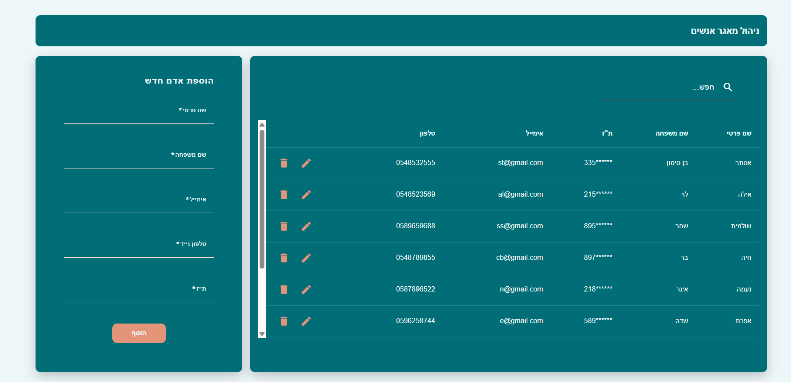

# People Management App (Angular + C#)

A full-stack application for managing a people directory: add, edit, delete, and list entries with free-text search, client/server validations, and a clean UI.

<p align="center">
  
</p>

---

## Features
✅ Add a new person via a validated form  
✅ Inline edit & save in the table  
✅ Delete from the list  
✅ Display all records on the main page (ID, full name, email, phone)  
✅ Free-text search across all table columns (first/last name, email, phone, ID)  
✅ Full CRUD API in C#  
✅ Validations on both sides: Angular + C# (DataAnnotations)  

---

## Tech Stack
**Frontend:** Angular, Angular Material  
**Backend:** ASP.NET Core Web API (C#)  
**Database:** SQL Server 

## Running the Application
### Backend (C# API)
Before running the backend, make sure to set your database connection string in the file:
PeopleManagerAPI/appsettings.json → inside the "ConnectionStrings" section.

### Frontend: 
```powershell
cd people-manager-client
npm install
npm start
# App available at: http://localhost:4200
```
